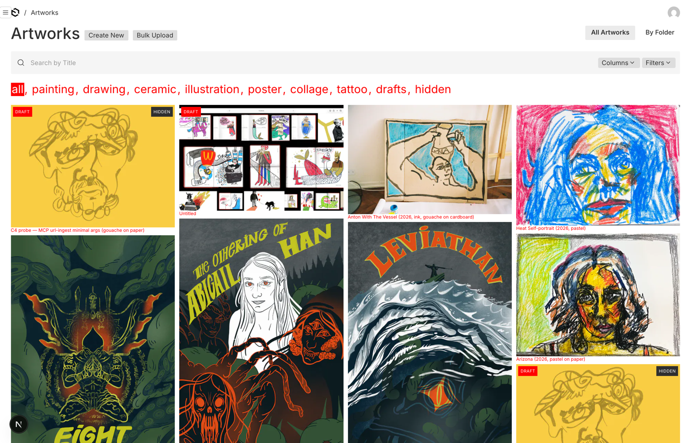
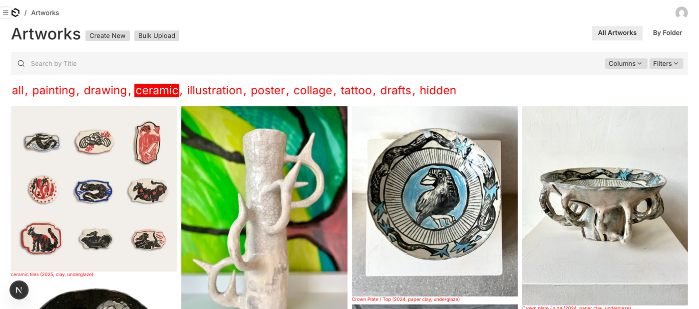
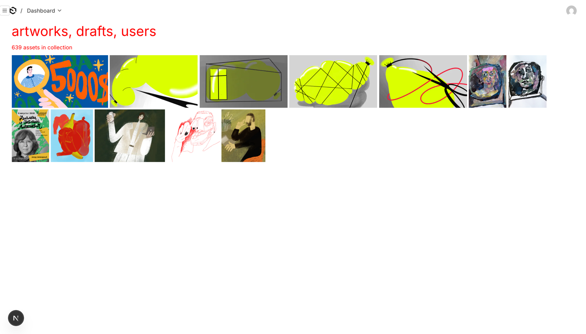
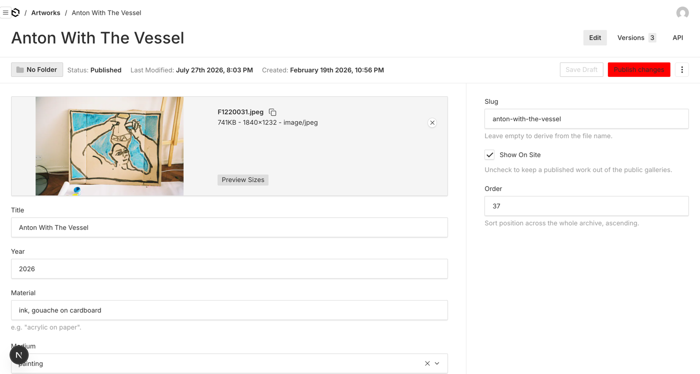

# Re-skinning the Payload admin toward Crow

**2026-07-27, after the playtest.** Anton and Alina judged the stock admin a
downgrade — "boring", "not image-native". `SPIKE-image-native-admin.md` fixed
the list view with ~140 lines. This is the rest of that job: colour, typography,
density, the dashboard, and the noise in the edit view, judged against
`../crow-cms` — the CMS Payload would replace.

**Deliverable: a judgeable artifact plus an honest cost, split by tier.** The
split is the answer, not the total — see §3 for why a single number cannot
answer the question this trial exists to answer.

---

## 1. What it looks like now

All captured from the running admin over headless Chrome (page-scoped by
construction — see `payload/tools/README.md`).

**What Crow's console actually is**, so the target is stated rather than
implied: white, Inter, one accent colour (`--color-accent: red`), a
comma-separated red filter row across the top, and a dense four-column wall of
pictures at their natural proportions with a tiny red caption reading
`Title (year, material)`. Almost no chrome.

**What was matched:** all of the above. The caption format is Crow's
`assetDescription()` verbatim; the round-robin column distribution is Crow's
`buildColumns()`; the filter row is Crow's `ConsoleHeader` shape applied to the
fields Payload actually has.

**What was not matched, and why:**

- **Crow's header lists tags as well as kinds.** Ours lists the seven mediums
  plus `drafts` and `hidden`. Tags are free text and unbounded, and the grid
  only sees the current page — a tag row built from loaded documents would
  change as you paginate, which is worse than not having it.
- **Crow's header is `text-5xl`.** Ours is 1.75rem. At 48px, ten filters wrap to
  three lines. **This is a judgement call and Anton should overrule it if he
  disagrees** — it is one number in `custom.scss`.
- **Payload's own chrome remains above the filter row**: the `Artworks` heading,
  Create New / Bulk Upload, the search field, Columns and Filters. Crow has one
  line where Payload has three. Removing them means replacing the list view
  outright, which is exactly the reimplementation the trial was warned about.

---

## 2. Verified, not assumed

| claim | how it was checked |
|---|---|
| the filter row actually refines the list | navigated to `where[medium][equals]=ceramic`: `ceramic` renders inverted **and** the grid shows only ceramics. REST reports `totalDocs = 48` for the same query, and the site shows 48 ceramics too |
| the theme variables reach the browser | the served bundle contains the `:root` block unlayered, so it beats Payload's `@layer payload-default` |
| Inter is actually fetched | the `@import` is at **byte 0** of the served stylesheet — a CSS `@import` anywhere else is dropped by the parser, which is the failure mode this was checked for |
| the dashboard replacement is first-party | `admin.dashboard.defaultLayout` displaces the stock cards; the import map still lists `@payloadcms/next/rsc#CollectionCards`, so the stock widget stays available in the picker |
| no schema change | `generate:types` produced only doc-comment and widget-slug edits. `admin.position` / `admin.hidden` are admin-only. **No migration needed** |
| the draft-leak guard still fires | broke it deliberately (removed the `_status` clause from `shared/payloadContent.ts`), got `exit=1` and `screenshot-2026-04-29-at-11-09-48-am: DRAFT IS PUBLICLY VISIBLE`; restored, `Spot-check clean` with the guard **exercised** — `9 draft(s), 1 of them with showOnSite=true` |
| build | `next build --debug-prerender` exits 0 |

**Two things that were dark until they were looked at:**

- **The admin came up in dark mode.** `admin.theme` defaults to `'all'`, which
  follows the OS, so on a machine set to dark none of the light-theme work was
  visible. Crow is white-only and has no theme switcher; `theme: 'light'` is one
  line and it also removes a control that has no Crow counterpart.
- **`payload/tools/screenshot.mjs` now always warns "images did not all finish
  loading".** It is a false alarm and should not be read as a broken capture:
  the grid sets `loading="lazy"`, so off-screen images legitimately never
  complete. The warning was written before the grid existed. Worth fixing before
  it trains someone to ignore it.

---

## 3. The cost, split by tier

The tiers are not cosmetic. They fail differently, and that is the whole point.

| tier | what | lines | how it breaks |
|---|---|---|---|
| **A** | theme variables (`:root` custom properties) | **12** | it doesn't — no Payload identifier is named |
| **B** | first-party config (`payload.config.ts`, field `admin.*`) | **24** (and 18 removed) | typechecked; a rename is a **build error** |
| **C** | components we wrote + their CSS | **247** | Payload can't break it, and Payload can't maintain it either |
| **D** | **Payload-internal CSS selectors** | **17** across **3 selectors** | **silently.** No error, no deprecation |
| | **total owned** | **300** | |

Tier C, itemised: `ArtworkGrid.tsx` 88 · `custom.scss` `.crow*` blocks 117 ·
`CrowDashboard.tsx` 33 · `mediums.ts` 9.

The spike reported ~140. This job roughly doubled it — and note *where* the
growth went: 27 lines onto the grid, and the rest into new components and their
styling. Tier A stayed at 12. **Almost nothing about looking like Crow was
expressible as a theme variable.**

### Tier D in full, because this is the argument against the Payload path

Three selectors, each an internal of Payload's own stylesheet that a near-weekly
release can rename with no error and no deprecation:

1. **`.collection-list--artworks .table`** *(pre-existing, from the spike)* —
   hides the default table. `beforeListTable` can only add a component *above*
   the table; there is no supported way to replace it from that slot. **When
   this goes stale the symptom is a redundant 630-row table quietly reappearing
   underneath the gallery.** Not an error.
2. **`.btn--style-primary`** *(new)* — Crow's red action button. Symptom when
   stale: buttons silently return to Payload's near-black.
3. **`.file-details .thumbnail`** *(new)* — the artwork, large, in its own
   editor. Payload renders an upload as a ~90px cover-cropped chip beside the
   filename, which for an art archive puts the metadata above the work. Symptom
   when stale: the artwork shrinks back to a chip.

**Why (2) and (3) are not in tier A, which is the finding:** Payload's admin is
monochrome by design and **exposes no brand-accent variable at all**. Its
primary button is painted with `--theme-elevation-800` — the same variable as
body text, input text, field labels and icon fills, 61 declarations in the
shipped stylesheet. Overriding it to red turns every form input's text red. So
"give this admin a brand colour" is **not expressible in Payload's supported
variable set**. That is a fact about Payload, not a shortcut taken here.

And (3) is the more instructive one: wanting the picture bigger *in the
picture's own editor* — about as core as a request gets for an art CMS — was not
expressible either, and immediately became a third coupled selector. **The tier-D
list grows with each thing you actually want.** It went from 1 to 3 in an
afternoon of ordinary requests.

### One tier-A override that is coupled anyway, named rather than hidden

`--theme-success-500: var(--crow-accent)` gives red focus rings. It is a
variable, so it cannot break silently — but its *meaning* is Payload's, and
"success" meaning "focus ring" is an accident of their stylesheet. Named side
effect today: the drag-over state of an upload dropzone is also red. Success
banners and pills use the 100/600 and 150/800 steps and are untouched, so
"saved" still reads as positive.

### One config-tier limit, verified in the source rather than assumed

`admin.dashboard.defaultLayout` only applies when the user has **no saved
dashboard preference** — `getItemsFromPreferences(...) ?? getItemsFromConfig(...)`.
Anyone who has already rearranged their dashboard keeps what they arranged. This
fails safe and visibly, but it means "did the new dashboard ship?" can have two
answers on two machines.

---

## 4. What this says about criterion 5

The spike put the question as: *can Payload be made image-native?* — answered
yes, cheaply. This pass asks the harder half: **can it be made to feel like
Crow, and what does holding it there cost?**

It can, and it now does. The cost is **300 lines, of which 247 is presentation
we own outright and 17 is coupled to identifiers Payload can rename without
telling us.** The durable, genuinely-supported surface — theme variables plus
first-party config — came to **36 lines**, and it bought colour, typography,
density, light-only, the dashboard, and the edit-view field layout. Everything
that made the admin *recognisably Crow* rather than merely *tidier* came out of
tiers C and D.

So the honest statement of the trade is not "Payload plus 300 lines". It is:
**Payload, plus a bespoke image-native admin written in React, living against
someone else's weekly release train, with three silent tripwires in it.** That
is approximately a description of Crow, with a database and a draft system
attached.

Whether that is a better position than owning Crow is Anton's call. This
document exists so it can be made against numbers and named failure modes rather
than an impression.

**Do not quote the 300 without the tier-D paragraph.** A total that hides the
difference between 12 lines of CSS variables and a selector that fails silently
is the number that would make this decision wrongly.

### The tier-D count is a series, not a number

**Any future styling pass must re-measure the Payload-internal selector count and
report it next to the previous values, never on its own.** The trend is the
decision-relevant output here, and a snapshot actively misleads:

| pass | date | tier-D selectors |
|---|---|---|
| image-native spike | 2026-07-27 | **1** |
| Crow re-skin (this) | 2026-07-27 | **3** |
| *(Anton closed styling 2026-07-28 — no further pass)* | | |

A snapshot says *"300 lines — cheap."* The series says *the fragile surface grows
whenever anyone actually styles this*, and it grew from 1 to 3 in a single
afternoon of ordinary requests. Those are different answers to criterion 5, and
only the second one is load-bearing. Add a row; do not overwrite one.

---

## 5. Anton's ruling — 2026-07-28

Asked directly: *"Does the re-skinned admin now look enough like Crow to judge
Payload fairly, or does it need another pass?"*

> **"Fair enough — stop, hand to Alina."**

**Settled by that answer**, and recorded here so they are not re-opened as though
still live. All three were offered to him explicitly and accepted as they stand:

| decision | outcome |
|---|---|
| Filter row at 1.75rem rather than Crow's `text-5xl` | **stands** |
| Header lists the seven mediums, `drafts` and `hidden` — but **not** tags | **stands** |
| Payload's own chrome (heading, Create New, search, Columns, Filters) remains | **stands** |

**The tier-D series is therefore closed at 3** unless someone reopens the styling.
No further pass; no new row in the table in §3.

### Still open — for Alina

Anton judged whether it *looks* like Crow. That is a different question from
whether it *works*, and only Alina can answer the second one.

| question | who |
|---|---|
| Is the edit view's field split right — Title/Year/Material/Medium/Tags in the main column, Slug/Show On Site/Order in the sidebar? | **Alina** |
| Dashboard: the last dozen touched works, or something else? | **Alina** |
| Does she miss tags in the filter row enough to justify the extra fetch? | **Alina** |

**Before Alina looks:** tell her two ceramics are absent ("a cup", "broken
vessel"). It is a known finding, not a mistake — if she meets it cold she will
read it as a bug and it will colour her feedback on everything else.
