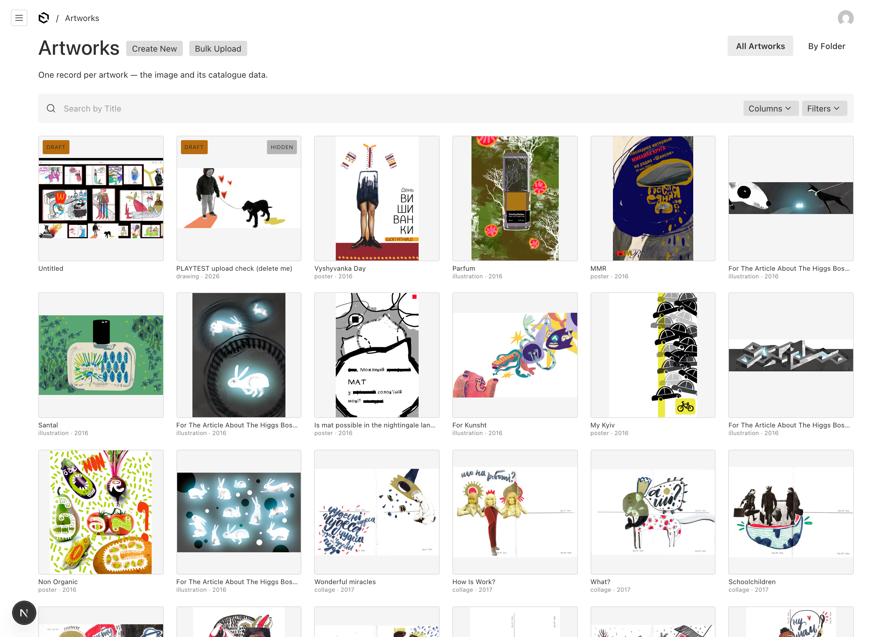

# Spike: making the Payload admin image-native

> **The trial is CLOSED — Payload was not adopted (2026-08-01).** This document
> is preserved as part of the record. The verdict, the criteria answers and the
> instructions for bringing it back up are in
> [`CLOSURE-payload-trial.md`](./CLOSURE-payload-trial.md).

**2026-07-27, after the playtest.** Anton and Alina judged the admin a downgrade —
"boring", "not image-native", artworks as rows of titles. They were judging
Payload's stock defaults, which no real deployment would ship. This spike builds
the fair version so it can be re-judged.

**Deliverable: a judgeable artifact plus an honest cost.** Not a finished admin.




Both captured from the running admin at 1400×1000, all images loaded before
capture. Second shot is `medium = ceramic` — 48 works, matching the site.

**Said precisely, because it is easy to overclaim.** This was not "630 artworks
rendering as images on one screen" — Payload's list is paginated and stays
paginated. What was observed is a **paginated list over 632 records**, at 12/18/24
cards per page, every card on every page loading its real artwork with **zero
broken images**, and the counter reporting the true total behind them
(`1-24 of 632`). Whether the grid holds up at 630 in a single unpaginated view is
**untested** and would need an explicit run to claim.

---

## What was tried, cheapest first

### 1. `folders: true` — one line, and not the answer

It does work, in the narrow sense: the folder view renders real thumbnail cards
(verified — a filed artwork drew its picture at 260×260). But:

- **The folder view shows only folders.** Unfiled artworks do not appear at all,
  so out of the box it is an empty screen. Making it useful means filing all 630
  works into folders by hand.
- **It is a second organisational axis that duplicates `series`.** We already
  modelled bodies of work; folders would be a parallel, unrelated hierarchy with
  no connection to what the site renders.
- **Drafts do not appear in it.** Draft/publish was the one thing the playtest
  liked, and it is invisible in the only image-native view Payload ships.

Kept enabled — it costs nothing and the "By Folder" toggle is visible in the
screenshots — but it does not answer the complaint.

### 2. A gallery grid on the list view — this is the artifact

`payload/components/ArtworkGrid.tsx`, mounted as `beforeListTable`.

The important choice: **it does not replace the list view.** `useListQuery()`
hands back the documents the default list has *already* fetched, so search,
filters, sorting, pagination, the Columns and Filters controls, and the result
counter all keep working with **no query code of ours**. The component only
decides how rows are drawn.

Verified through the real admin, not by reading the code:

| | result |
|---|---|
| baseline | `1-12 of 632`, 12 cards |
| search "vietnam" | `1-1 of 1` → *Vietnamese woman drawing* |
| filter `medium=ceramic` | `1-12 of 48` — the site shows 48 ceramics too |
| pagination, page 3 | `25-36 of 632` |
| sort `-year` | applies |

Cards carry the thumbnail (from `sizes.w480`, the same bucket the site reads),
title, medium · year, and badges for **draft** and **hidden** — so the feature
the playtest liked is visible at a glance, which it is not in the folder view.

---

## The cost — the actual finding

| what | lines (code, excl. comments) |
|---|---|
| `payload/components/ArtworkGrid.tsx` | **61** |
| `app/(payload)/custom.scss` | **75** |
| wiring in `Artworks.ts` (`beforeListTable` + `folders`) | **4** |
| **total custom code** | **~140** |

**Do not round that down.** 140 lines is small, but the number alone understates
it in three ways:

1. **It leans on a Payload-owned class name.** `beforeListTable` can only add a
   component *above* the table; there is no supported way to replace the table
   from that slot. Hiding it uses the `.collection-list--artworks .table`
   selector — exactly the kind of internal that a project shipping near-weekly
   renames without it being a breaking change. When it breaks, the symptom is a
   gallery with a redundant 630-row table underneath, not an error.
2. **It is presentation we now own forever.** Card layout, badges, truncation,
   empty states, responsive breakpoints — none of this is Payload's to maintain.
   Every upgrade is a re-test.
3. **This is the cheap version.** It inherits the query layer. Anything the
   default list cannot express — drag-to-reorder in the grid, hover previews,
   bulk actions on cards, a lightbox — starts from a custom list view instead,
   which is where the reimplementation the charge warned about actually begins.

**What that points at.** ~140 lines buys a good-looking gallery today. But the
thing being maintained is a bespoke image-native admin, written in React, living
against someone else's weekly release train. That is approximately a description
of Crow. The criterion-5 question is therefore not "can Payload be made
image-native" — it demonstrably can, cheaply — but **whether owning that layer on
top of Payload is meaningfully lighter than owning Crow.**

That is Anton's call, and this spike exists to make it with a number rather than
an impression.

---

## Two bugs fixed while in here

**The site's edit button pointed at the wrong CMS.** `hrefForConsole` always
built a `NEXT_PUBLIC_CROW_CMS` URL, so under `CONTENT_SOURCE=payload` the edit
link sent you to Crow's console — to a record that CMS was not serving. Now the
record carries `cmsEditPath` and `hrefForEdit` follows it. Verified both ways:

```
CROW mode     -> https://crowcms.vercel.app/projects/alikro?aside=edit:anton-with-the-vessel
PAYLOAD mode  -> /admin/collections/artworks/98        (= anton-with-the-vessel)
```

The path is carried **on the record** rather than read from a client-visible copy
of the flag, because `CONTENT_SOURCE` is server-only — a `NEXT_PUBLIC_` twin
would give the A/B two switches that can disagree.

**Drafts were publicly visible on the site.** `fetchAllAssetMetadataFromPayload`
filtered `showOnSite` but never `_status`. The collection's `access.read` does
scope anonymous reads to published — but the site reads through the **Local API,
which bypasses access control entirely**, so that predicate never ran for us.

This could not surface during preparation: all 630 migrated records are
published, and the test draft had `showOnSite: false`. It appeared the moment a
real person made a draft in the admin during the playtest — that draft was
live on the site. Fixed; `/all` is back to 575 and byte-identical to the
pre-playtest baseline.

**Now enforced, not remembered.** `npm run migrate:spotcheck` asserts that no
draft appears in what the site actually renders. It calls the real
`fetchAllAssetMetadataFromPayload()` rather than reconstructing its query — a
reconstruction would drift from the thing it guards, which is exactly how the
bug survived. Proven to fire: with the `_status` clause removed the check
reports

```
Draft-leak guard: 2 draft(s) in the archive, 1 of them with showOnSite=true.
1 PROBLEM(S):
  screenshot-2026-04-29-at-11-09-48-am: DRAFT IS PUBLICLY VISIBLE — it is in what the site renders
```

and with it restored, `OK — the site layer returned 575 asset(s) and none of the
2 draft(s) is among them`. When no draft carries `showOnSite: true` it prints
**NOT EXERCISED** rather than passing quietly, because a guard that silently
no-ops is the failure mode it exists to prevent.

*Side effect worth knowing:* the two fixture drafts have no Crow counterpart, so
the existing parity check called them slug-carry failures and made the whole
spot-check permanently red. Parity checks now skip records that were never in
the migration, told apart by the export's own join key (`fileName`) — so genuine
slug drift is still caught, while a native upload is not a false alarm. A
permanently red check is one nobody reads.

**Known limit of that skip, so the next reader knows it is scoped and not
total.** A record that drifted on *both* slug **and** filename matches neither
key, reads as a native upload, and is therefore skipped silently. Reaching that
state takes someone re-uploading a *different* file onto a migrated record —
marginal, and strictly less bad than the permanent-red it replaces, which is why
it is recorded here rather than fixed. If it ever needs closing, the fix is to
carry a migration marker on the record instead of inferring provenance from the
export.

**It is worth naming what this one means for the trial.** Draft/publish was the
single feature the playtest rated a win, and in the consumer it was broken. The
win is real, but it was not actually being exercised end-to-end until now.

**Method note, because this is the generalisable part.** Every component on this
path was individually correct: the collection *did* scope reads to published,
the site *did* filter visibility, drafts *were* being created properly. The path
between them was broken — the Local API bypasses access control, so the one
component holding the `_status` rule was never on the path at all. **An
end-to-end path can be broken while every component along it looks correct**,
which is why it took a real person doing a real thing to expose it. Two
independent accidents had kept it invisible: every migrated record was
published, and the one test draft happened to carry `showOnSite: false`. Neither
was a check that passed — both were coincidences that looked like passing checks.

---

## State

- **Nine draft records remain, and one is load-bearing — do not tidy it away.**
  *(Updated 2026-07-27: was two. The criterion-4 probe added seven, ids 633–639.)*
  All nine are drafts with `showOnSite: false` except one, all invisible to the
  site — `/all` is still 575 and byte-identical to the pre-playtest baseline,
  which is the draft-leak guard holding under exactly the load it was written
  for: an agent creating drafts.

  **Record 632** (a screenshot uploaded during the playtest, **`showOnSite:
  true`**) is the one that matters. It is the only record in the archive that can
  express the draft-leak failure — all 630 migrated records are published — so
  without it the guard has nothing to test against and passes vacuously. Fixture,
  not litter. 631 ("PLAYTEST upload check") is mine and is inert.

- **The rule for records with no Crow counterpart is a rule, not a list.**
  `migrate:spotcheck` decides by the export's own join key — a record matching
  neither `slug` nor `fileName` never came from the migration, so parity checks
  are skipped and announced rather than failed. That is why seven new probe
  records appeared without anyone editing the check, and why the spot-check did
  not go permanently red on another agent's work. Any future backfill must treat
  "no export match" the same way: **normal, not an error.**

  *The evidence that it is genuinely a rule and not a workaround dressed up as
  one:* the criterion-4 agent, which did not write it, reused the same
  `fromMigration` predicate for a case nobody had anticipated — a draft created
  with **no file at all**, which Payload permits because it skips upload
  validation for drafts. It scoped the excuse tightly (a published record, or any
  migrated record, still fails with no file) and announced the skip rather than
  passing over it quietly. **A rule reused correctly by someone who did not write
  it is the only real test of whether it was a rule.** An enumeration could not
  have been reused that way — it would have needed editing first, and the seven
  probe records would have arrived as seven false failures.
- An empty folder, "SPIKE probe (folder-view test)", left from testing option 1.
  The real artwork filed into it was put back; only my own test draft is still in
  it. Mine to remove on request.
- Anton changed his admin password during the playtest, so
  `PLAYTEST-CREDENTIALS.local.md` is stale for his account. Alina's still works.
